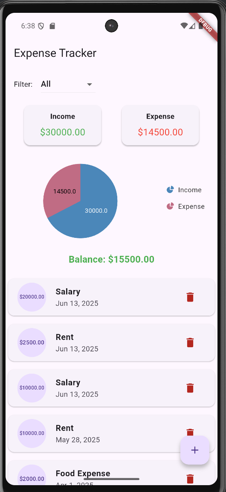
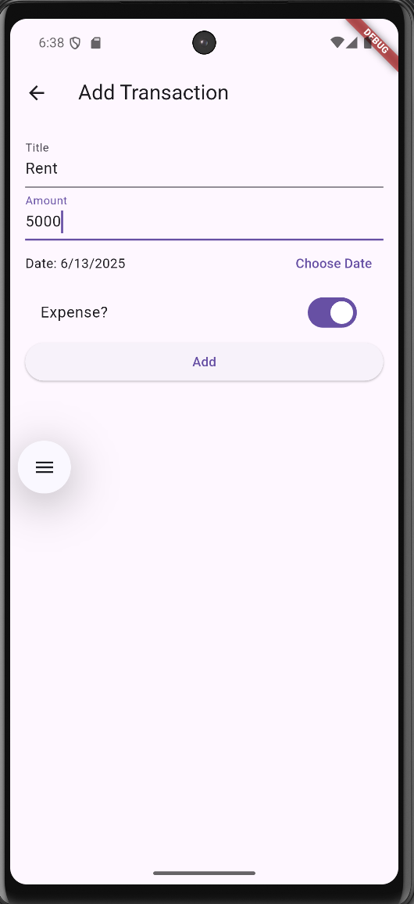

# expense_tracker_app

A simple, intuitive Flutter app for tracking daily income and expenses. Users can add transactions, view summaries, and analyze spending through charts.

---

## 📱 Screenshots

| Home Screen | Add Expense |
|-------------|--------------|
|  |  |

---

## 📱 Working Video

# 💸 Expense Tracker App

---

## 🚀 Features

- 📊 Visualize income and expenses using charts
- 📝 Add and delete transactions
- 📅 Filter transactions by date
- 💾 Persistent data with local storage

---

## 🛠️ Tech Stack

- **Flutter** – UI development
- **Dart** – Programming language
- **syncfusion_flutter_charts** – Charting library
- **Local storage** – For saving transactions

---

## 🧑‍💻 How to Run

1. **Clone the repo**

   ```bash
   git clone https://github.com/Nirjal-shrestha14/Expense-tracker-app.git
   cd expense_tracker_app
